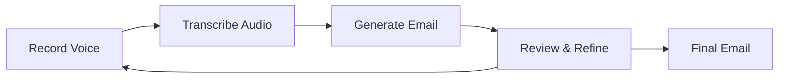

# Getting Started

AudioMail offers two ways to interact with the system: a user-friendly **Web UI** and a powerful **Command Line Interface**. This guide covers the basics of both.

## Choosing Your Interface

=== "Web UI (Recommended for Beginners)"
    - 🎨 Visual, intuitive interface
    - 🔘 Simple start/stop buttons  
    - 📱 Great for occasional use
    - 🖼️ Real-time feedback and status
    
    **Best for**: First-time users, visual learners, occasional email drafting

=== "CLI (Power Users)"
    - ⚡ Fast, keyboard-driven workflow
    - 🔧 Easy to integrate with scripts
    - 💻 Works over SSH/remote connections
    - 🚀 Minimal resource usage
    
    **Best for**: Developers, power users, automation, remote work

## Basic Workflow

Both interfaces follow the same basic workflow:



### Step 1: Record Your Instructions

Speak naturally about the email you want to send:

!!! example "Good Voice Instructions"
    "Send an email to John thanking him for the meeting yesterday. Mention that I'll send the project proposal by Friday and ask if he has any specific requirements for the format."

### Step 2: Review the Transcription

AudioMail will show you what it heard. If the transcription is incorrect, you can record again.

### Step 3: Review the Generated Email

The AI will create a professional email based on your instructions. Review it for accuracy and tone.

### Step 4: Refine (Optional)

If the email needs changes, provide voice feedback:

!!! example "Refinement Examples"
    - "Make it more formal"
    - "Add my phone number in the signature"
    - "Change the subject line to include the project name"
    - "Make it shorter and more direct"

## Quick Start Examples

### Example 1: Thank You Email

**Voice Input**: 
> "Write a thank you email to Sarah for the presentation yesterday. Say that the insights about market trends were really valuable and I'd like to schedule a follow-up meeting next week."

**Generated Email**:
```
Subject: Thank you for yesterday's presentation

Hi Sarah,

Thank you for the excellent presentation yesterday. Your insights about market trends were really valuable and provided great perspective for our team.

I'd like to schedule a follow-up meeting next week to discuss how we can implement some of these insights. Would you be available?

Best regards,
[Your name]
```

### Example 2: Project Update

**Voice Input**:
> "Send an update to the project team. Tell them the Phase 1 deliverables are complete and we're on track for the deadline. Mention the next meeting is Thursday at 2 PM."

**Generated Email**:
```
Subject: Project Update - Phase 1 Complete

Hi Team,

I'm pleased to update you that all Phase 1 deliverables have been completed successfully. We remain on track to meet our project deadline.

Our next team meeting is scheduled for Thursday at 2 PM. Please let me know if you have any conflicts.

Best regards,
[Your name]
```

## Tips for Better Results

### Recording Quality

- **Quiet Environment**: Record in a quiet space to improve transcription accuracy
- **Clear Speech**: Speak clearly and at a normal pace
- **Good Microphone**: Use a quality microphone for better audio capture

### Voice Instructions

- **Be Specific**: Include recipient, purpose, and key details
- **Natural Language**: Speak as you would normally explain the email to someone
- **Context**: Provide background information when necessary

!!! tip "Structure Your Instructions"
    Start with: "Send an email to [recipient] about [topic]..."
    Then add: "Mention that [key points]..."
    End with: "Ask for [call to action]..."

### Refinement Tips

- **Tone Adjustments**: "Make it more formal/casual/friendly"
- **Length Changes**: "Make it shorter/more detailed"
- **Content Edits**: "Add [specific information]" or "Remove the part about [topic]"
- **Format Changes**: "Add bullet points" or "Include a call to action"

## Common Use Cases

### Business Communications
- Meeting follow-ups
- Project updates
- Client communications
- Internal team messages

### Personal Emails
- Thank you notes
- Event invitations
- Appointment scheduling
- Follow-up messages

### Templates and Patterns
- Weekly status reports
- Meeting requests
- Introduction emails
- Feedback requests

## Next Steps

Now that you understand the basics:

- [Learn the Web UI](ui.md) - Detailed guide to the visual interface
- [Master the CLI](cli.md) - Advanced command-line usage
- [Configure AudioMail](configuration.md) - Customize for your needs
- [Troubleshooting](troubleshooting.md) - Solve common issues